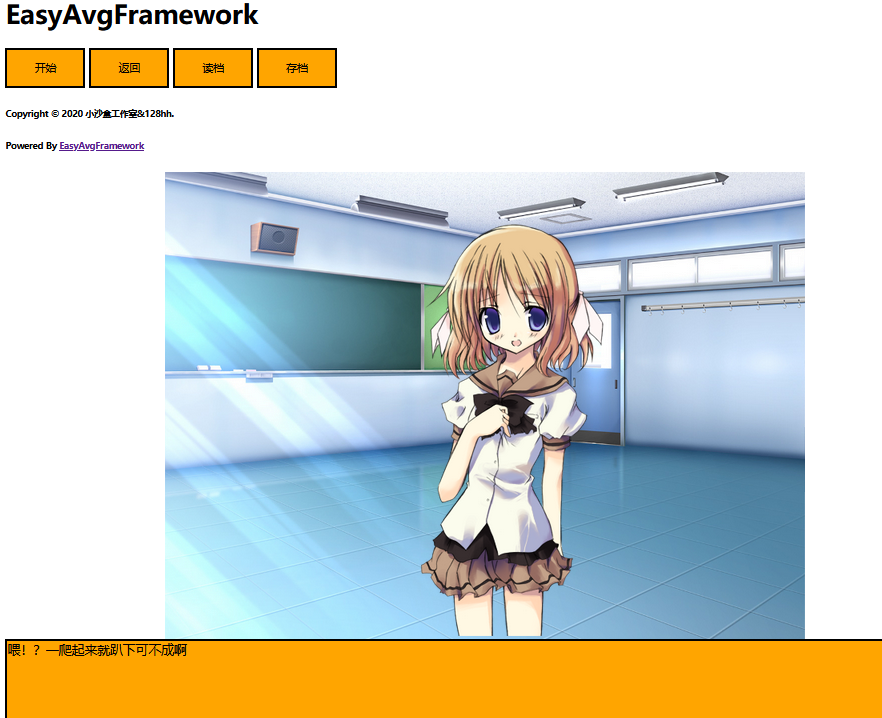

# 这是一个基于jquery dom渲染的视觉小说游戏框架

# 亮点：
1. 轻量级
2. core.js是它的核心 只有7kb大小
3. 每个功能分模块使用 你可以在module文件夹下面看见不同的模块
4. 灵活性大，每个对象基本都是jquery对象，你可以根据自己的需求自由更改代码，添加代码
5. 运行在浏览器上，跨平台，当然你也可以使用其他工具打包
6. var Engine=new EasyAvg() 使用此方法获得引擎类
# 截图展示

<a target="_blank" href="https://github.com/little-game-and-simple-software/EasyAvgFrameWork/releases/download/0.01_demo/EasyAvgFrameWork.zip" >Demo下载</a>

## API
1. API可以在API.txt.js查看
2. 你可以通过源码学习如何使用此开源库

## 许可协议:
1. 对于开源游戏和免费游戏是免费使用的。对于商业游戏也是免费的
2. 如果复制了此开源库并进行了修改，必须保留此文件。
3. 此开源库中的素材，请勿用于商业用途，仅供学习与研究

Demo中使用的素材来源于《Noesis01-诉说谎言的记忆》
## code CopyRight© 小沙盒工作室